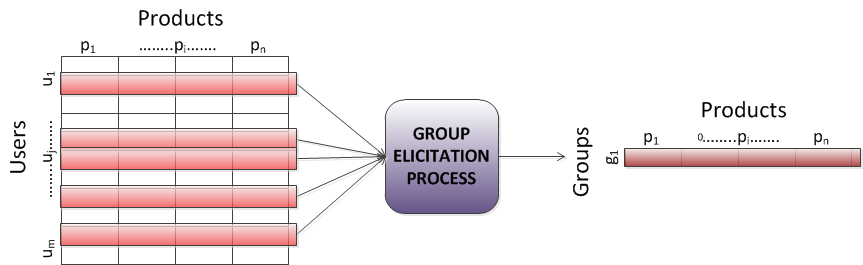

State-of-the-Art in Group Elicitation Strategies
================================================

This section presents the main elicitation or aggregation strategies being used in GRecSys. [@masthoff11group]
The purpose of them are to adapt to the group as a whole based on information about individual users’ likes and dislikes (i.e.: aggregating individual ratings into a group rating).

Veure imatge de [Gartrell, M., Xing, X., Lv, Q., Beach, A., Han, R., Mishra, S., & Seada, K. (2010). Enhancing group recommendation by incorporating social relationship interactions. Proceedings of the 16th ACM international conference on Supporting group work (pp. 97–106). New York, NY, USA: ACM. doi:10.1145/1880071.1880087]

-----------------------

[@Senot:2011:EGP:2283696.2283850]

There exist two main approaches for providing recommendations to a group of users when the “real” group profile is not available.
1. The first combines individual recommendations to generate a list of group recommendations,
2. while the second computes group recommendations using a group profile derived from individual profiles.

* The majority-based strategies use the "most popular" choices (user preferences, item rankings, etc.) among group members. 

For example, GroupCast [McCarthy et al., 2001] displays content that suits the intersection of user profiles when the people are close to a public screen. 

_Plurality Voting_, _Borda Count_, _Copeland Rule_ , _Approval Voting_
     
* The consensus-based strategies consider the preferences of all group members. 

Examples include the _Utilitarian strategy_ which averages the preferences of all the group members, the _Fairness strategy_, or the _Alternated Satisfaction strategy_.

As an example, MusicFX [McCarthy and Anagnost, 1998] recommends the most relevant music station in a fitness center using a group profile computed by summing the squared individual preferences. By applying this strategy 71% of clients noticed a positive difference (as compared to the absence of the recommendation system). 

_Median_, _Average_, _Additive_, _Average without Misery_, _Fairness_ and _Multiplicative_
  
* The borderline strategies, also called role-based strategies, consider only a subset of items (item categories) in individual profiles, based on user roles or any other relevant criteria.

_Least Misery_, _Most Pleasure_, _Most respected person_

For example, PolyLens [O’Connor et al., 2001] uses the Least Misery strategy to recommend movies for small user groups based on the MovieLens database (http://www.movielens.org). Their survey showed that 77% of PolyLens users found group recommendations more helpful than individual ones. Yet this system only works with a single strategy.

-------------------------

##Overview

Eleven aggregation strategies inspired by Social Choice Theory are summarized in Table 3 (see [17] for more details).

------------------------------------
        A   B   C   D   E   F   G   H   I   J
------ --- --- --- --- --- --- --- --- --- ---
Peter  10  4   3   6   10  9   6   8   10  8
Jane   1   9   8   9   7   9   6   9   3   8
Mary   10  5   2   7   9   8   5   6   7   6
----------------------------------------------

Table: Example of individual ratings for ten items (A to J)

-------------------------------------------------------------------------------
Strategy          How it works                               Example
----------------- ------------------------------------------ -----------------------------------------
_Plurality        Uses ‘first past the post’: repetitively,  A is chosen first, as it has the highest 
Voting_           the item with the most votes is chosen.    rating for the majority of the group, 
                                                             followed by E (which has the highest 
                                                             rating for the majority when excluding A).

_Median_          Middle value of individual ratings         B’s group rating is `5`, from `(4,9,5)`. 

_Average_ or      Averages individual ratings                B’s group rating is `6`, namely `(4+9+5)/3`.
_Utilitarian_         

_Additive_        Adds individual ratings                    B’s group rating is `18`, namely `4+9+5`.

_Multiplicative_  Multiplies individual ratings              B’s group rating is `180`, namely `4*9*5`.

_Borda Count_     Counts points from items’ rankings in      A’s group rating is `17`, namely `0` (last for Jane)
                  the individuals’ preference lists,         `+ 9` (first for Mary) `+ 8` (shared top 3 for Peter)
                  with bottom item getting 0 points, next 
				  one up getting one point, etc

_Copeland Rule_   Counts how often an item beats other       F’s group rating is `5`, as F beats 7 items
                  items (using majority vote) minus          (B,C,D,G,H,I,J) and looses from 2 (A,E).
                  how often it looses

_Approval Voting_ Counts the individuals with ratings for    B’s group rating is `1` and F’s is `3`.
                  the item above a approval threshold
                  (e.g. 6)

_Least Misery_    Takes the minimum of individual ratings    B’s group rating is `4`, namely the smallest of `4,9,5`.

_Most Pleasure_   Takes the maximum of individual ratings    B’s group rating is `9`, namely the largest of `4,9,5`.

_Average without  Averages individual ratings, after         J’s group rating is `7.3` (the average of `8,8,6`), 
Misery_           excluding items with individual            while A is excluded because Jane hates it.
                  ratings below a certain threshold (say 4).                                            
 
_Fairness_        Items are ranked as if individuals         Item E may be chosen first (highest for Peter), 
                  are choosing them in turn.                 followed by F (highest for Jane) and A (highest for Mary).
                                                             
_Most respected   Uses the rating of the                     If Jane is the most respected person, 
person_           most respected individual.                 then A’s group rating is `1`. If Mary is most respected, then it is `10`.
--------------------------------------------------------------------------------------------------------------

Table: Overview of Aggregation Strategies

## Detailed description

The following sections will review theses strategies in detail.

In order to ease the different strategies, a base example is provided:

-------------------

[@Salamo:2012:GRC:2339097.2339115]

Most well-known strategies used in collaborative filtering algorithms for recommendation generation.

1. The Least misery strategy, as defined in Eq. 13, chooses a product $p_i$ based on the minimum satisfaction of the individual preferences

The rationale is that a group is as satisfied as its least satisfied member. 
--veure formula

$$least_misery(p_i,MI) = arg \min{}$$
$$MSE = \frac{1}{n}\sum_{i}^{n} (p_i - a_i)^2 $$
 
2. Most pleasure strategy selects the maximum satisfaction of the individual preferences, see Eq. 14. 
It considers that at least one member will be maximally satisfied.
--veure formula

Previous strategies assume the consensus based on the satisfaction of one individual: the least or the most satisfied. 
There is no warranty that the recommendations will suit the whole group.

3. Multiplicative strategy multiplies the satisfaction of the individual users, see Eq. 15. 
With this strategy, it might happen that a member with unique tastes always lose out because their opinion happens to be a minority preference.

-----------------------------------------------

[@sweb2012]

Though recommendation approaches have addressed group preference modeling explicitly to a rather limited extent, or in an indirect way in prior work in the 
computing field, the related issue of social choice (also called group decision making, i.e. deciding what is best for a group given the opinions of individuals) 
has been studied extensively in Economics, Politics, Sociology, and Mathematics [24, 33].

The models for the construction of a social welfare function in these works are similar to the group modeling problem we put forward here. 

Other areas in which Social Choice Theory has been studied are Collaborative Filtering (CF), Meta-search, and Multi-agent systems.

In CF, preferences of a group of individuals are aggregated to produce a predicted preference for somebody outside the group. 
Meta-search can be seen –and formulated– as a form of group decision making, where the aggregated inputs are produced by information retrieval systems instead of people. In a meta-search engine, the rankings produced by multiple search engines need to be combined into one single list, forming the well-known problem of rank aggregation in Information Retrieval [3]. Ensemble recommenders combining several recommendation algorithms also involve a particular case of this problem, similarly to meta-search except for the absence of a query.
Finally, in Multi-agent systems, agents need to take decisions that are not only rational from an individual’s point of view, but also from a social point of view. 

In all the above fields, different strategies to combine several users’ preferences and to aggregate item ranking lists can be applied based on the utilized social welfare function. 

These strategies are classified by Senot and colleagues [27] into three categories, namely:

* majority-based strategies, which strength the “most popular” choices (user preferences, item rankings, etc.) among the group, e.g. Borda Count, Copeland Rule, and Plurality Voting strategies;
* consensus-based (or democratic) strategies, which average somehow all the available choices, e.g. Additive Utilitarian, Average without Misery, and Fairness strategies;
* and border-line strategies, also called role-based strategies in [5], which only consider a subset of choices based on user roles or any other relevant criterion, e.g. Dictatorship, Least Misery and Most Pleasure strategies.

---------

In the following, we assume a user has a preference (utility) for each item represented in the form of a numeric 1-10 rating. 
In all the cases, the greater the rating value, the most useful the item is for the user.

### Plurality voting strategy

Each member votes for his preferred item and the one with the highest votes is selected. In this strategy, the items that were rated highest are combined as follows:

1. A user is randomly selected
2. His *L* top rated items are taking into account.
	 - From them, the item that causes the most utility to the group is chosen for the group profile with a score equal to *N*, i.e., the number of items.
3. Restart the process in step 1 considering the remaining *N–1,N–2,etc.* items and uniformly diminishing to 1 the further assigned scores.

In the final list, the higher score the more influential the item is for the group.

          $i_{1}$ $i_{2}$ $i_{3}$ $i_{4}$ $i_{5}$ $i_{6}$ $i_{7}$ $i_{8}$ $i_{9}$ $i_{10}$
--------- ------- ------- ------- ------- ------- ------- ------- ------- ------- --------
 $u_{1}$    10      4       3       6       10      9       6       8       10      8
 $u_{2}$    1       9       8       9       7       9       6       9       3       8
 $u_{3}$    10      5       2       7       9       8       5       6       7       6
**group**  **5**  **3**   **1**   **8**   **10**   **9**   **2**  **7**   **4**   **6**
-----------------------------------------------------------------------------------------

Table: Group choice selection following the _plurality voting strategy_. The ranked list of items for the group would be $\lbrace i_{5}, i_{6}, i_{4}, i_{8}, i_{10}, i_{1}, i_{9}, i_{2}, i_{7}, i_{3}\rbrace$ following the user selecting order $\lbrace u_{1},u_{2},u_{3}\rbrace$ and $L=3$.

To better understand the strategy, let us explain its first 4 iterations on the example shown in Table [@table].

i. Iteration 0
	1. The user $u_{1}$ is selected
	2. Whose $L=3$ top ranked items are $i_{1}$, $i_{5}$ and $i_{9}$.
		- From these items, we choose item $i_{5}$ with a score $N=10$. Item $i_{5}$ is the one with most votes to all three users, whose votes for items $i_{1}$, $i_{5}$ and $i_{9}$ are respectively 21, 26 and 20.
ii. Iteration 1
	1. The user $u_{2}$ is selected
	2. Whose $L=3$ top ranked items are $i_{2}$, $i_{4}$ and $i_{6}$.
		- From these items, we choose item $i_{6}$ with a score $N-1=9$. Item $i_{6}$ is the one with most votes to all three users, whose votes for items $i_{2}$, $i_{4}$ and $i_{6}$ are respectively 18, 22 and 26.
iii. Iteration 2
	1. The user $u_{3}$ is selected
	2. Whose $L=3$ top ranked items are $i_{1}$, $i_{4}$ and $i_{9}$.
		- From these items, we choose item $i_{4}$ with a score $N-2=8$. Item $i_{4}$ is the one with most votes to all three users, whose votes for items $i_{1}$, $i_{4}$ and $i_{9}$ are respectively 21, 22 and 20.
iv. Iteration 3
	1. The user $u_{1}$ is selected
	2. Whose $L=3$ top ranked items are $i_{1}$, $i_{9}$ and $i_{8}$.
		- From these items, we choose item $i_{8}$ with a score $N-3=7$. Item $i_{8}$ is the one with most votes to all three users, whose votes for items $i_{1}$, $i_{9}$ and $i_{8}$ are respectively 21, 20 and 23.

### Median strategy

The group rating for a particular item is computed as the middle value of the group members’ ratings. 

(@eq_stgy_median)  $$gr_{i} = median(r_{i,j})$$

As shown in equation (@eq_stgy_median)....

          $i_{1}$ $i_{2}$ $i_{3}$ $i_{4}$ $i_{5}$ $i_{6}$ $i_{7}$ $i_{8}$ $i_{9}$ $i_{10}$
--------- ------- ------- ------- ------- ------- ------- ------- ------- ------- --------
 $u_{1}$    10      4       3       6       10      9       6       8       10      8
 $u_{2}$    1       9       8       9       7       9       6       9       3       8
 $u_{3}$    10      5       2       7       9       8       5       6       7       6
**group** **10**   **5**   **3**   **7**   **9**   **9**   **6**   **8**   **7**   **8**
-----------------------------------------------------------------------------------------

Table: Group choice selection following the _median strategy_. The ranked list of items for the group would be $\lbrace i_{1},i_{5}-i_{6},i_{8}-i_{10},i_{4}-i_{9},i_{7},i_{2},i_{3}\rbrace$.
	   

### Average strategy

In this strategy, the group rating for a particular item is computed as the average rating over all individuals (Figure 3). 
Note that if no user or item weighting is conducted, the ranking list of this strategy is the same as that of the _Utilitarian strategy_.

$$gr_{i} = avg(r_{i,j}) = \frac{1}{n}\cdot\sum_{j=1}^{n}r_{i,j}$$

          $i_{1}$ $i_{2}$ $i_{3}$ $i_{4}$ $i_{5}$ $i_{6}$ $i_{7}$ $i_{8}$ $i_{9}$ $i_{10}$
--------- ------- ------- ------- ------- ------- ------- ------- ------- ------- --------
 $u_{1}$    10      4       3       6       10      9       6       8       10      8
 $u_{2}$    1       9       8       9       7       9       6       9       3       8
 $u_{3}$    10      5       2       7       9       8       5       6       7       6
**group** **7**   **6**   **4.3** **7.3** **8.7** **8.7** **5.7** **7.7** **6.7** **7.3**
-----------------------------------------------------------------------------------------

Table: Group choice selection following the _average strategy_. The ranked list of items for the group would be $\lbrace i_{5}-i_{6}, i_{8}, i_{4}-i_{10}, i_{1}, i_{9}, i_{2}, i_{7}, i_{3}\rbrace$.

### Additive utilitarian strategy

Preference values from group members are added, and the larger the sum the more influential the item is for the group (Figure 1). 
Note that the resulting group ranking will be exactly the same as that obtained taking the average of the individual preference values. 
A potential problem of this strategy is that individuals’ opinions tend to be less significant as larger the group is.
This strategy could also use a weighted schema, where a weight is attached to individual preferences depending on multiple criteria for single or multiple users.

$$gr_{i} = \sum_{j=1}^{n}r_{i,j}$$

          $i_{1}$ $i_{2}$ $i_{3}$ $i_{4}$ $i_{5}$ $i_{6}$ $i_{7}$ $i_{8}$ $i_{9}$ $i_{10}$
--------- ------- ------- ------- ------- ------- ------- ------- ------- ------- --------
 $u_{1}$    10      4       3       6       10      9       6       8       10      8
 $u_{2}$    1       9       8       9       7       9       6       9       3       8
 $u_{3}$    10      5       2       7       9       8       5       6       7       6
**group** **21**   **18**   **13**  **22**  **26**  **26**  **17**  **23**  **20**  **22**
-----------------------------------------------------------------------------------------

Table: Group choice selection following the _additive strategy_. The ranked list of items for the group would be $\lbrace i_{5}-i_{6}, i_{8}, i_{4}-i_{10}, i_{1}, i_{9}, i_{2}, i_{7}, i_{3}\rbrace$.

### Multiplicative utilitarian strategy

Instead of adding the preferences, they are multiplied, and the larger the product the more influential the item is for the group (Figure 2).
Note that this strategy could be self-defeating: in a small group, the opinion of each individual may have too much impact on the product.

$$gr_{i} = \prod_{j=1}^{n}r_{i,j}$$

          $i_{1}$ $i_{2}$ $i_{3}$ $i_{4}$ $i_{5}$ $i_{6}$ $i_{7}$ $i_{8}$ $i_{9}$ $i_{10}$
--------- ------- ------- ------- ------- ------- ------- ------- ------- ------- --------
 $u_{1}$    10      4       3       6       10      9       6       8       10      8
 $u_{2}$    1       9       8       9       7       9       6       9       3       8
 $u_{3}$    10      5       2       7       9       8       5       6       7       6
**group** **100** **180** **48**  **378** **630** **648** **180** **432** **210** **384**
-----------------------------------------------------------------------------------------

Table: Group choice selection following the _multiplicative strategy_. The ranked list of items for the group would be $\lbrace i_{6}, i_{5}, i_{8}, i_{10}, i_{4}, i_{9}, i_{2}-i_{7}, i_{1}, i_{3}\rbrace$.

### Borda count strategy

This strategy is a two-step process:

1. Normalization step 
	* Scores are assigned to the items according to their ratings in a user profile: those with the lowest value get zero scores, the next one up one point, and so on.
	* When an individual has multiple preferences with the same rating, the averaged sum of their hypothetical scores are equally distributed to the involved items.
2. Addition step
	* An additive strategy is followed, and the larger the sum the more influential the item is for the group.

<!-- -->

          $i_{1}$ $i_{2}$ $i_{3}$ $i_{4}$ $i_{5}$ $i_{6}$ $i_{7}$ $i_{8}$ $i_{9}$ $i_{10}$
--------- ------- ------- ------- ------- ------- ------- ------- ------- ------- --------
 $u_{1}$    10      4       3       6       10      9       6       8       10      8
 $u_{2}$    1       9       8       9       7       9       6       9       3       8
 $u_{3}$    10      5       2       7       9       8       5       6       7       6
-----------------------------------------------------------------------------------------

$\Downarrow$

           $i_{1}$   $i_{2}$   $i_{3}$   $i_{4}$   $i_{5}$   $i_{6}$   $i_{7}$   $i_{8}$   $i_{9}$   $i_{10}$
--------- --------- --------- --------- --------- --------- --------- --------- --------- --------- ----------
 $u_{1}$      8        1         0         2.5        8        6         2.5       4.5        8         4.5
 $u_{2}$      0       7.5       4.5        7.5        3       7.5         2        7.5        1         4.5
 $u_{3}$      9       1.5        0         5.5        8        7         1.5       3.5       5.5        3.5
**group**   **17**   **10**   **4.5**    **15.5**  **19**   **20.5**    **6**    **15.5**  **14.5**  **12.5**
--------------------------------------------------------------------------------------------------------------

Table: Group choice selection following the _borda count strategy_. The ranked list of items for the group would be $\lbrace i_{6}, i_{5}, i_{1}, i_{4}-i_{8}, i_{9}, i_{10}, i_{2}, i_{7}, i_{3}\rbrace$.

As an example, we show how the first step of the process is performed for user $u_1$. That is, how ratings are normalized according to their relative relevance within the users’ preferences.

> The items sequence in increasing rating value for user $u_1$ are $\lbrace i_{3},i_{2},i_{4}-i_{7},i_{8}-i_{10},i_{6},i_{1}-i_{5}-i_{9}\rbrace$.
>
> 1. For item $i_{3}$ a *0* score is assigned to $r_{1,3}$.
> 2. Item $i_{2}$ receives a score of value *1* to $r_{1,2}$. 
> 3. The next score to be assigned would be *2*. In this case, the next two items with lowest rating value,$\lbrace i_{4}-i_{7}\rbrace$, have the same rating. 
> Therefore, the two next scores *2* and *3* are considered, and the average of them (i.e., $(2+3)/2=2.5$) is assigned to both items to $r_{1,4}$ and $r_{1,7}$.
> 4. The next score to be assigned would be *4*. In this case, the next two items with lowest rating value,$\lbrace i_{8}-i_{10}\rbrace$, have the same rating. 
> Therefore, the two next scores *4* and *5* are considered, and the average of them (i.e., $(4+5)/2=4.5$) is assigned to both items to $r_{1,8}$ and $r_{1,10}$.
> 5. Item $i_{6}$ receives a score of value *6* to $r_{1,6}$. 
> 6. The next score to be assigned would be *7*. In this case, the next three items with lowest rating value,$\lbrace i_{1}-i_{5}-i_{9}\rbrace$, have the same rating. Therefore, the next three scores *7*, *8* and *9* are considered, and the average of them (i.e., $(7+8+9)/3=8$) is assigned to corresponding items to $r_{1,1}$, $r_{1,5}$ and $r_{1,9}$.

### Copeland rule strategy

Being a form of majority voting, this strategy sorts the items according to their _Copeland index_:

> The difference between the number of times an item beats (has higher ratings) the rest of the items and the number of times it loses

In the bottom table, a +/– symbol in the _ij_-th cell (_i_ for rows, and _j_ for columns) means that item at _j_-th column was rated higher/lower 
than item at _i_-th row by the majority of the users.
A zero value in a cell means that the corresponding items were rated with the same number of “beats” and “looses”.

          $i_{1}$ $i_{2}$ $i_{3}$ $i_{4}$ $i_{5}$ $i_{6}$ $i_{7}$ $i_{8}$ $i_{9}$ $i_{10}$
--------- ------- ------- ------- ------- ------- ------- ------- ------- ------- --------
 $u_{1}$    10      4       3       6       10      9       6       8       10      8
 $u_{2}$    1       9       8       9       7       9       6       9       3       8
 $u_{3}$    10      5       2       7       9       8       5       6       7       6
-----------------------------------------------------------------------------------------

The _Copeland_ corresponding matrix is:

          $i_{1}$ $i_{2}$ $i_{3}$ $i_{4}$ $i_{5}$ $i_{6}$ $i_{7}$ $i_{8}$ $i_{9}$ $i_{10}$
--------- ------- ------- ------- ------- ------- ------- ------- ------- ------- --------
 $i_{1}$   $0$     $-$      $-$     $-$     $0$     $-$     $-$     $-$     $0$     $-$
 $i_{2}$   $+$     $0$      $-$     $+$     $+$     $+$     $0$     $+$     $+$     $+$
 $i_{3}$   $+$     $+$      $0$     $+$     $+$     $+$     $+$     $+$     $+$     $+$
 $i_{4}$   $+$     $-$      $-$     $0$     $+$     $+$     $-$     $0$     $0$     $-$
 $i_{5}$   $0$     $-$      $-$     $-$     $0$     $-$     $-$     $-$     $-$     $-$
 $i_{6}$   $+$     $-$      $-$     $-$     $+$     $0$     $-$     $-$     $-$     $-$
 $i_{7}$   $+$     $0$      $-$     $+$     $+$     $+$     $0$     $+$     $+$     $+$
 $i_{8}$   $+$     $-$      $-$     $0$     $+$     $+$     $-$     $0$     $+$     $-$
 $i_{9}$   $0$     $-$      $-$     $0$     $+$     $+$     $-$     $-$     $0$     $-$
 $i_{10}$  $+$     $-$      $-$     $+$     $+$     $+$     $-$     $+$     $+$     $0$
**group** **+7**  **-6**  **-9**  **+1**  **+8**  **+5**  **-6**  **0**   **+3**  **-3**
-----------------------------------------------------------------------------------------

Table: Group choice selection following the _Copeland rule strategy_. The ranked list of items for the group would be $\lbrace i_{5}, i_{1}, i_{6}, i_{9}, i_{4}, i_{8}, i_{10}, i_{2}-i_{7}, i_{3}\rbrace$.

To better understand the strategy, let's explain 3 cells with different symbol values:

* *Cell 2,1*: $+$ symbol. Means that item $i_{1}$ was rated higher than item $i_{2}$ by the majority of the users.

*users*      $i_{1}$ $i_{2}$ 
------------ ------- --------
$u_{1}$      10      4    
$u_{2}$      1       9    
$u_{3}$      10      5    
*beats (B)*  *2*     *1*
*loses (L)*  *1*     *2*
**B-L**      **1**   **-1**
-------------------------------

* *Cell 5,1*: $0$ symbol. Means means that the item $i_{1}$ and item $i_{5}$ were rated with the same number of “beats” and “looses”.

*users*      $i_{1}$ $i_{5}$ 
------------ ------- --------
$u_{1}$      10      10    
$u_{2}$      1       7    
$u_{3}$      10      9    
*beats (B)*  *1*     *1*
*loses (L)*  *1*     *1*
**B-L**      **0**   **0**
-------------------------------

* *Cell 5,3*: $-$ symbol. Means that item $i_{3}$ was rated lower than item $i_{5}$ by the majority of the users.

*users*      $i_{3}$ $i_{5}$ 
------------ ------- --------
$u_{1}$      3       10    
$u_{2}$      8       7    
$u_{3}$      2       9    
*beats (B)*  *1*     *2*
*loses (L)*  *2*     *1*
**B-L**      **-1**   **1**
-------------------------------

### Approval voting strategy

A threshold $\theta$ is considered for the item ratings:

* Only those ratings greater or equal than the threshold value are taking into account for the profile combination.
* An item receives a vote for each user profile that has its rating surpassing the established threshold value.

The larger the number of votes the more influential the item is for the group. This strategy intends to promote the election of moderate alternatives: those that are not strongly disliked.

          $i_{1}$ $i_{2}$ $i_{3}$ $i_{4}$ $i_{5}$ $i_{6}$ $i_{7}$ $i_{8}$ $i_{9}$ $i_{10}$
--------- ------- ------- ------- ------- ------- ------- ------- ------- ------- --------
 $u_{1}$    10      4       3       6       10      9       6       8       10      8
 $u_{2}$    1       9       8       9       7       9       6       9       3       8
 $u_{3}$    10      5       2       7       9       8       5       6       7       6
-----------------------------------------------------------------------------------------

For a threshold $\theta = 5$, we get the following votes:

          $i_{1}$ $i_{2}$ $i_{3}$ $i_{4}$ $i_{5}$ $i_{6}$ $i_{7}$ $i_{8}$ $i_{9}$ $i_{10}$
--------- ------- ------- ------- ------- ------- ------- ------- ------- ------- --------
 $u_{1}$    1       -       -       1       1       1       1       1       1       1
 $u_{2}$    -       1       1       1       1       1       1       1       -       1
 $u_{3}$    1       -       -       1       1       1       -       1       1       1
**group**  **2**  **1**   **1**   **3**   **3**   **3**   **2**   **3**   **2**   **3**
-----------------------------------------------------------------------------------------

Table: Group choice selection following the _approval voting strategy_. The ranked list of items for the group would be $\lbrace i_{4}-i_{5}-i_{6}-i_{8}-i_{10}, i_{1}-i_{7}-i_{9}, i_{2}-i_{3}\rbrace$.

See table \thetable.
See equation \theequation.
See figure \thefigure.
Arabic of table \arabic{table}

### Least misery strategy

The score of an item in the group profile is the minimum of its ratings in the user profiles. The lower rating, the less influential the item is for the group. 
Thus, a group is as satisfied as its least satisfied member (Figure 5).

Note that a minority of the group could dictate the opinion of the group: although many members like a certain item, if one member really hates it, the preferences associated to it will not appear in the group profile.

$$gr_{i} = \underset{j}{min}(r_{i,j})$$

          $i_{1}$ $i_{2}$ $i_{3}$ $i_{4}$ $i_{5}$ $i_{6}$ $i_{7}$ $i_{8}$ $i_{9}$ $i_{10}$
--------- ------- ------- ------- ------- ------- ------- ------- ------- ------- --------
 $u_{1}$    10      4       3       6       10      9       6       8       10      8
 $u_{2}$    1       9       8       9       7       9       6       9       3       8
 $u_{3}$    10      5       2       7       9       8       5       6       7       6
**group** **1**   **4**   **2**   **6**    **7**  **8**    **5**   **6**   **3**   **6**
-----------------------------------------------------------------------------------------

Table: Group choice selection following the _least misery strategy_. The ranked list of items for the group would be $\lbrace i_{6}, i_{5}, i_{4}-i_{8}-i_{10}, i_{7}, i_{2}, i_{9}, i_{3}, i_{1}\rbrace$.

### Most pleasure strategy

It works as the _least misery strategy_, but instead of considering for an item the smallest ratings of the users, it selects the greatest ones.
The higher rating the more influential the item is for the group, as shown in Figure 6.

$$gr_{i} = \underset{j}{max}(r_{i,j})$$

          $i_{1}$ $i_{2}$ $i_{3}$ $i_{4}$ $i_{5}$ $i_{6}$ $i_{7}$ $i_{8}$ $i_{9}$ $i_{10}$
--------- ------- ------- ------- ------- ------- ------- ------- ------- ------- --------
 $u_{1}$    10      4       3       6       10      9       6       8       10      8
 $u_{2}$    1       9       8       9       7       9       6       9       3       8
 $u_{3}$    10      5       2       7       9       8       5       6       7       6
**group** **10**  **9**   **8**    **9**   **10**  **9**   **6**   **9**  **10**  **8**
-----------------------------------------------------------------------------------------

Table: Group choice selection following the _most pleasure strategy_. The ranked list of items for the group would be $\lbrace i_{1}-i_{5}-i_{9}, i_{2}-i_{4}-i_{6}-i_{8}, i_{3}-i_{10}, i_{7}\rbrace$.

### Average without misery strategy

As the average strategy, this one assigns an item the average of its ratings in the individual profiles. The difference here is that those items which have a rating under a certain threshold $\theta$ will not be considered in the group recommendations. 
Figure 4 shows an example of group formation following this strategy with a threshold value of 3. 

$$gr_{i} = \begin{cases}
  -, & \text{if }\exists_{j}:r_{i,j} \leqslant \theta \\
  avg(r_{i,j}), & \text{otherwise}
\end{cases}$$

          $i_{1}$ $i_{2}$ $i_{3}$ $i_{4}$ $i_{5}$ $i_{6}$ $i_{7}$ $i_{8}$ $i_{9}$ $i_{10}$
--------- ------- ------- ------- ------- ------- ------- ------- ------- ------- --------
 $u_{1}$    10      4       3       6       10      9       6       8       10      8
 $u_{2}$    1       9       8       9       7       9       6       9       3       8
 $u_{3}$    10      5       2       7       9       8       5       6       7       6
**group**   -     **6**     -     **7.3** **8.7** **8.7** **5.7** **7.7**   -     **7.3**
-----------------------------------------------------------------------------------------

Table: Group choice selection following the _average without misery strategy_. The ranked list of items for the group would be $\lbrace i_{5}-i_{6}, i_{8}, i_{4}-i_{10},i_{2}, i_{7}\rbrace$.

### Fairness strategy

In this strategy, the items that were rated highest and cause less misery to all the users of the group are combined as follows:

1. A user is randomly selected
2. His *L* top rated items are taking into account.
	 - From them, the item that less misery causes to the group (that from the worst alternatives that has the highest rating) 
is chosen for the group profile with a score equal to *N*, i.e., the number of items.
3. Restart the process in step 1 considering the remaining *N–1,N–2,etc.* items and uniformly diminishing to 1 the further assigned scores.

In the final list, the higher score the more influential the item is for the group.

> Note that this list would be different if we let other users to choose first.

          $i_{1}$ $i_{2}$ $i_{3}$ $i_{4}$ $i_{5}$ $i_{6}$ $i_{7}$ $i_{8}$ $i_{9}$ $i_{10}$
--------- ------- ------- ------- ------- ------- ------- ------- ------- ------- --------
 $u_{1}$    10      4       3       6       10      9       6       8       10      8
 $u_{2}$    1       9       8       9       7       9       6       9       3       8
 $u_{3}$    10      5       2       7       9       8       5       6       7       6
**group**  **4**  **3**   **1**   **8**   **10**   **9**   **5**  **7**   **2**   **6**
-----------------------------------------------------------------------------------------

Table: Group choice selection following the _fairness strategy_. The ranked list of items for the group would be $\lbrace i_{5}, i_{6}, i_{4}, i_{8}, i_{10}, i_{7}, i_{1}, i_{2}, i_{9}, i_{3}\rbrace$ following the user selecting order $\lbrace u_{1},u_{2},u_{3}\rbrace$ and $L=3$.

To better understand the strategy, let us explain its first 3 iterations on the example shown in Table [@table].

i. Iteration 0
	1. The user $u_{1}$ is selected
	2. Whose $L=3$ top ranked items are $i_{1}$, $i_{5}$ and $i_{9}$.
		- From these items, we choose item $i_{5}$ with a score $N=10$. Item $i_{5}$ is the one that less misery causes to users $u_{2}$ and $u_{3}$, whose lowest ratings for items $i_{1}$, $i_{5}$ and $i_{9}$ are respectively 1, 7 and 3.
ii. Iteration 1
	1. The user $u_{2}$ is selected
	2. Whose $L=3$ top ranked items are $i_{2}$, $i_{4}$ and $i_{6}$.
		- From these items, we choose item $i_{6}$ with a score $N-1=9$. Item $i_{6}$ is the one that less misery causes to users $u_{1}$ and $u_{3}$, whose lowest ratings for items $i_{2}$, $i_{4}$ and $i_{6}$ are respectively 4, 6 and 8.
iii. Iteration 2
	1. The user $u_{3}$ is selected
	2. Whose $L=3$ top ranked items are $i_{1}$, $i_{4}$ and $i_{9}$.
		- From these items, we choose item $i_{4}$ with a score $N-2=8$. Item $i_{4}$ is the one that less misery causes to users $u_{1}$ and $u_{2}$, whose lowest ratings for items $i_{1}$, $i_{4}$ and $i_{9}$ are respectively 1, 6 and 3.

+NOTA: veure fórmules a 
  [Gartrell, M., Xing, X., Lv, Q., Beach, A., Han, R., Mishra, S., & Seada, K. (2010). Enhancing group recommendation by incorporating social relationship interactions. Proceedings of the 16th ACM international conference on Supporting group work (pp. 97–106). New York, NY, USA: ACM. doi:10.1145/1880071.1880087]
  [Jameson, A., & Smyth, B. (2007). Recommendation to Groups. The Adaptive Web: Methods and Strategies of Web Personalization, 4321, 596–627.]

---------------
## Existing Group RecSys stategies

### Average strategy

Travel Decision Forum [15] implements multiple group modeling strategies, including the _average strategy_ and the median strategy, which uses the middle value of the group members’ ratings, instead of the average value.

In [36], Yu and colleagues present a TV program recommender that performs a variation of the average strategy, where the group preference vector minimizes its distance compared to the individual members’ preference vectors.

### Additive utilitarian strategy

For example, in INTRIGUE [2], weights are assigned to particular users’ ratings depending on the number of people in the group, and the group’s members’ relevance (children and disabled have a higher relevance).

### Least misery strategy

PolyLens [23] uses this strategy, assuming a group of people going to watch a movie together tends to be small, and the group is as happy as its least happy member. 

### Average without misery strategy

MusicFX [21], which chooses a radio station for background music in a fitness center, follows an average without misery strategy, and a weighted random selection is made from the top stations in order to avoid starvation and always picking the same station.
CATS system [22] helps users to choose a joint holiday based on individuals’ critiques on holiday package features, and applying the misery aspect.
